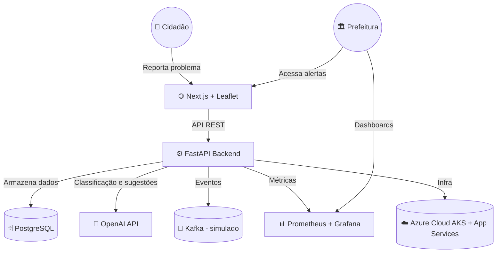

# 🤖🌍 CivixMind – Plataforma de Inteligência Urbana Colaborativa

**Turma:** 2TDSPS-2025  
**Grupo:** FutureOps Lab  
**Repositório:** [https://github.com/DudaAraujo14/Checkpoint.git](https://github.com/DudaAraujo14/Checkpoint.git)

## 👥 Integrantes do Grupo

| Nome Completo     | RM      | Função       |
|------------------ |---------|--------------|
| Maria Eduarda     | 560944  | DEV HOM PRD  |

---

## 📝 Descrição da Solução

**CivixMind** é uma plataforma que combina **IA, dados abertos e participação cidadã** para ajudar cidades a identificar problemas urbanos em tempo real e recomendar soluções baseadas em dados e comportamentos coletivos.

Utilizando **inteligência artificial generativa**, **big data urbano**, **relatos de cidadãos**, e **sensores integrados na nuvem**, o sistema interpreta os principais desafios da cidade (como buracos, lixo irregular, alagamentos, falhas no transporte público ou iluminação) e cria **modelos preditivos e colaborativos** que auxiliam governos e comunidades a tomarem decisões mais inteligentes.

---

## 🎯 Objetivo

Criar um **sistema inteligente de cogestão urbana**, onde cidadãos e máquinas trabalham juntos para tornar a cidade mais eficiente, limpa, justa e sustentável.

---

## 🧭 Método Adotado

- Kanban com Trello para gerenciamento de tarefas  
- CI/CD com GitHub Actions  
- Infraestrutura como Código (IaC) com Terraform  
- Backend em Python (FastAPI)  
- Frontend com Next.js + Leaflet para mapas  
- Contêineres com Docker e orquestração via Kubernetes (AKS)  
- Monitoramento com Prometheus + Grafana  
- IA generativa com OpenAI API (GPT-4)  
- Integração com dados abertos e sensores urbanos (simulados)

---

## 💡 Proposta de Valor

- 📊 Dados urbanos em tempo real com alertas inteligentes  
- 🧠 Análises e sugestões automatizadas com IA  
- 🤝 Participação cidadã de forma ativa e anônima  
- 🏙️ Apoio à tomada de decisões governamentais com base em evidências  
- ♻️ Ferramenta aberta e escalável para cidades inteligentes

---

## 👤 Clientes

- Prefeituras e órgãos públicos  
- ONGs e movimentos urbanos  
- Cidadãos e comunidades locais  
- Startups GovTech e empresas de urbanismo  

---

## 🧩 Segmento de Clientes

- Cidades com iniciativas de **Smart City**  
- Regiões com desafios estruturais (alagamentos, trânsito, lixo, etc.)  
- Comunidades periféricas que precisam de visibilidade  
- Instituições que promovem **governança participativa**

---

## ⚙️ Etapas e Recursos de Implantação

| Etapa                              | Recursos Utilizados                                   |
|-----------------------------------|--------------------------------------------------------|
| Definição do escopo e MVP         | Trello, Figma, Notion                                 |
| Criação do backend                | Python (FastAPI), PostgreSQL, Docker                  |
| Infraestrutura e nuvem            | Azure (App Services, PostgreSQL, AKS, Functions)      |
| Pipelines CI/CD                   | GitHub Actions + Terraform                            |
| Coleta de dados urbanos           | Dados Abertos, APIs públicas, crowdsourcing           |
| Integração de IA generativa       | OpenAI API (GPT-4) para sumarização e sugestões       |
| Frontend web responsivo           | Next.js + Leaflet.js                                  |
| Dashboards de gestão urbana       | Grafana + Prometheus                                  |
| Monitoramento contínuo            | Azure Monitor, Log Analytics                          |

---

## 🗺️ Diagrama de Arquitetura

## Estrutura do MVP (projeto inicial)
civixmind/
│── backend/
│   ├── app/
│   │   ├── main.py        # FastAPI
│   │   ├── models.py      # Modelos ORM
│   │   ├── routes.py      # Rotas de API
│   │   └── ai.py          # Integração OpenAI
│   └── Dockerfile
│
│── frontend/
│   ├── pages/
│   │   ├── index.js       # Página inicial com mapa
│   │   └── report.js      # Formulário de reportar problema
│   ├── components/
│   │   └── Map.js         # Leaflet mapa interativo
│   └── Dockerfile
│
│── infra/
│   ├── main.tf            # Terraform infra Azure
│   ├── variables.tf
│   └── outputs.tf
│
│── monitoring/
│   ├── prometheus.yml
│   └── grafana_dashboards.json
│
│── README.md
│── docker-compose.yml
---

##🧱 Rascunho da Solução

Cidadãos reportam problemas urbanos via app ou site.

A IA (via OpenAI) analisa, classifica e sugere ações.

A prefeitura recebe alertas com criticidade e recomendações.

Dados são cruzados com APIs públicas e sensores urbanos.

Dashboards mostram a saúde urbana em tempo real.
---

## 🔑 Recursos-Chave

☁️ Microsoft Azure – App Service, AKS, PostgreSQL, Monitor

🐳 Docker + Kubernetes – Containerização e orquestração

🧠 OpenAI GPT-4 – IA generativa para análise urbana

⚙️ Terraform – Provisionamento automático da infraestrutura

🐍 Python (FastAPI) – Backend leve e escalável

🌐 Next.js + Leaflet.js – Frontend moderno com mapas interativos

📈 Grafana / Prometheus – Dashboards de métricas urbanas

🛰️ Kafka (simulado) – Eventos urbanos em tempo real
---

## 🐳 Docker Compose
version: "3.9"
services:
  backend:
    build: ./backend
    ports:
      - "8000:8000"
    depends_on:
      - db

  frontend:
    build: ./frontend
    ports:
      - "3000:3000"
    depends_on:
      - backend

  db:
    image: postgres:15
    environment:
      POSTGRES_USER: admin
      POSTGRES_PASSWORD: admin
      POSTGRES_DB: civixmind
    ports:
      - "5432:5432"
    volumes:
      - db_data:/var/lib/postgresql/data

volumes:
  db_data:
---

## 🧮 Versões, Como Rodar e Próximos Passos

Versões:
| Tecnologia | Versão |
| ---------- | ------ |
| Python     | 3.11   |
| FastAPI    | 0.110  |
| Node.js    | 20.x   |
| Next.js    | 13.x   |
| PostgreSQL | 15     |
| Docker     | 24     |
| Terraform  | 1.7.x  |
| Azure CLI  | 2.52   |
| Prometheus | 2.48   |
| Grafana    | 10.x   |
---

## Como Rodar Localmente:

1.Clone o repositório
git clone https://github.com/DudaAraujo14/Checkpoint.git
cd Checkpoint

2.Suba os serviços com Docker 
docker-compose up --build

3.Acesse:

Frontend → http://localhost:3000

Backend (API) → http://localhost:8000/docs

Banco → localhost:5432

##📚 Referências

[OpenAI API Documentation](https://platform.openai.com/docs?utm_source=chatgpt.com)

[FastAPI Documentation](https://fastapi.tiangolo.com/?utm_source=chatgpt.com)

[Terraform Azure Provider](https://registry.terraform.io/providers/hashicorp/azurerm/latest/docs?utm_source=chatgpt.com)

[Leaflet Maps](https://leafletjs.com/?utm_source=chatgpt.com)

[Grafana Docs](https://grafana.com/docs/?utm_source=chatgpt.com)

[Prometheus Docs](https://prometheus.io/docs/introduction/overview/?utm_source=chatgpt.com)

[Azure for Smart Cities](https://azure.microsoft.com/en-us/industries/government/smart-cities/?utm_source=chatgpt.com)

[GitHub Actions Docs](https://docs.github.com/en/actions?utm_source=chatgpt.com)
